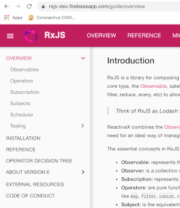

# Overview
I needed a place to play around with RxJS and wanted one where my experiments would be durable. 
This has started out as really just coding out the [Overview examples](https://rxjs-dev.firebaseapp.com/guide/overview) 
from the RxJS website. They've been embellished a little bit, but the meat of them is from the Overview. 

I intend to grow the experiments as long as my interest holds and I have time to invest in learning more.

The structure of the source code will very much follow the menuing system you see 
[here](https://rxjs-dev.firebaseapp.com/guide/overview) on the RxJS website... at least as of 4/23/2020.



## Requirements

You must have the [Quokka](https://quokkajs.com/) plugin for your environment to run these the way I've configured this project for. You can also
run them in some other way if you like... for me... I'll take Quokka.

## Setup

Run the following from the root directory of your project. This will install any dependancies that the project needs
as well as the pre and post install scripts to set up link-module-alias.

```$xslt
npm install
```

## Sources
These are some of the resources that were used in putting this playground together.

1. [Angular/RxJs When should I unsubscribe from `Subscription`](https://stackoverflow.com/questions/38008334/angular-rxjs-when-should-i-unsubscribe-from-subscription) - 
A really good discussion on unsubscribing in Angular via the use of Subjects.
1. [Ben Lesh](https://medium.com/@benlesh)
    1. [RxJS: Don’t Unsubscribe](https://medium.com/@benlesh/rxjs-dont-unsubscribe-6753ed4fda87)
1. [jsdom](https://github.com/jsdom/jsdom)
1. [link-module-alias](https://www.npmjs.com/package/link-module-alias)
    1. [Aliasing module paths in Node JS](https://arunmichaeldsouza.com/blog/aliasing-module-paths-in-node-js)
1. [Quokka](https://quokkajs.com/)
    1. [Quokka - jsdom plugin](https://github.com/wallabyjs/jsdom-quokka-plugin)
1. [RxJS: inserting a delay between each item of a stream - btheado](https://observablehq.com/@btheado/rxjs-inserting-a-delay-between-each-item-of-a-stream)
1. [RxJS](https://rxjs-dev.firebaseapp.com/)
    1. [RxJS - Overview](https://rxjs-dev.firebaseapp.com/guide/overview)
    1. [Learn RxJS](https://www.learnrxjs.io/)
1. [The Best Way To Unsubscribe RxJS Observables In The Angular Applications! - Tomas Trajan
](https://medium.com/angular-in-depth/the-best-way-to-unsubscribe-rxjs-observable-in-the-angular-applications-d8f9aa42f6a0)
1. [Unsubscribing an observable in Angular 6](https://getgoingit.blogspot.com/2018/06/unsubscribing-observable-in-angular-2.html)
1. [What are schedulers in RxJS - Kwinten Pisman](https://blog.strongbrew.io/what-are-schedulers-in-rxjs/)


